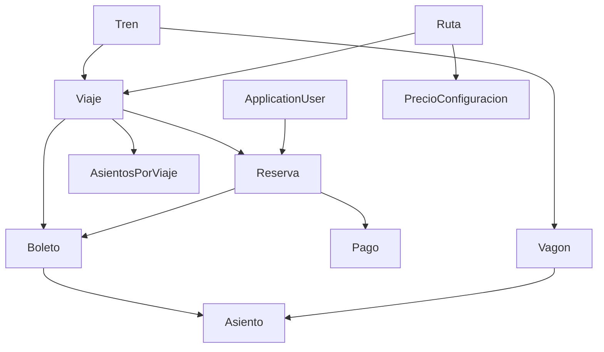

# Sistema de Reservas de Tren - Proyecto

## Descripción general

Este proyecto es una aplicación web para la gestión de reservas de boletos de tren turísticos, visualización de rutas en Google Maps, selección visual e interactiva de asientos (tipo cine/vagón), generación de reportes y emisión de facturas. Está pensado para facilitar la gestión y venta de boletos, ofrecer una experiencia de usuario moderna y permitir análisis de ventas y ocupación.

---

## Objetivos

- **Reservas online:** Permitir a los usuarios crear cuentas y reservar boletos para rutas de tren turístico.
- **Integración Google Maps:** Visualizar las rutas disponibles sobre un mapa, con cada ruta en un color distinto y la posibilidad de seleccionarlas.
- **Selección de asientos:** Elegir asientos de forma visual e intuitiva, con vagones diferenciados por categoría (preferencial/económico) y colores, similar a la reserva en cines.
- **Cálculo automático de precios:** Los precios varían según categoría (niño, adulto, tercera edad) y tipo de asiento, con configuraciones fijas por ruta.
- **Reportes gráficos:** Generar reportes visuales sobre ventas, asientos más vendidos, rutas más usadas, etc.
- **Emisión de factura:** Imprimir una factura con los datos de la compra y del cliente.

---

## Arquitectura general

- **Backend:** ASP.NET Core (WebAPI + MVC)
- **Frontend:** Razor MVC, integración con JS (para Google Maps y selección de asientos)
- **Autenticación:** Identity (ApplicationUser)
- **Base de datos:** SQL Server (EF Core)
- **Mapas:** Google Maps API (Polyline para rutas)
- **Gráficas de reportes:** Chart.js o Google Charts (en el frontend)
- **Facturación:** Razor ViewModel + PDF (opcionalmente DinkToPdf/Rotativa)

---

## Modelo de datos (Tablas principales)

### 1. **Entidad Principal**
- **ApplicationUser:** Usuario del sistema (hereda de IdentityUser)
- **Tren:** Tren físico (uno o varios por sistema)
- **Ruta:** Recorrido entre dos puntos, con coordenadas y color para Google Maps

### 2. **Configuración**
- **Vagon:** Vagón físico del tren, asociado a un tipo (preferencial/económico)
- **Asiento:** Asiento físico dentro de un vagon, usado para la selección visual
- **AsientosPorViaje:** Cantidad y disponibilidad de asientos por viaje y tipo
- **PrecioConfiguracion:** Precios fijos por ruta, tipo y categoría de asiento

### 3. **Operación**
- **Viaje:** Ejecución de una ruta, fecha y tren asignado
- **Reserva:** Reservas realizadas por usuarios para viajes
- **Boleto:** Boleto emitido con asiento y categoría
- **Pago:** Pagos realizados para reservas

---

## Ejemplo de clases (formato utilizado en el proyecto)

```csharp
public class Viaje
{
    // Necesarios
    public int Id { get; set; }
    public DateTime FechaSalida { get; set; }
    public TimeSpan HoraSalida { get; set; }
    public EstadoViaje Estado { get; set; }

    // FKs
    public int TrenId { get; set; }
    public int RutaId { get; set; }

    // No necesarios para ingresar desde Swagger
    public Tren Tren { get; set; }
    public Ruta Ruta { get; set; }
    public List<AsientosPorViaje> AsientosPorViaje { get; set; }
    public List<Reserva> Reservas { get; set; }
    public List<Boleto> Boletos { get; set; }
}
```
*(El resto de las clases siguen el mismo patrón, ver carpeta Modelos/.)*

---

## Funcionalidades principales

### **1. Visualización de rutas en Google Maps**
- Cada ruta tiene un campo `Coordenadas` (lista de puntos lat/lng) y un `Color`.
- Se muestran en el frontend usando Google Maps API, con polilíneas de distintos colores.
- El usuario puede elegir la ruta a visualizar desde un select.

### **2. Selección de asientos (tipo cine/vagón)**
- Los asientos están divididos por vagones y categorías (preferencial/económico).
- El frontend muestra la disposición real (por filas, colores y vagón) y permite seleccionar el asiento deseado.
- Los asientos ya reservados aparecen como ocupados/no seleccionables.

### **3. Reservas y boletos**
- El usuario selecciona el viaje, el vagón y el asiento.
- El sistema calcula el precio según la configuración fija (tabla PrecioConfiguracion).
- Se genera la reserva, los boletos y el pago asociado.

### **4. Reportes**
- Reportes por tipo de asiento más vendido, ruta más usada, ocupación de vagones, etc.
- Visualización en gráficas de barras, pastel y líneas.
- Consultas sobre las tablas Boleto, Reserva, Viaje, Ruta, etc.

### **5. Facturación**
- Al completar el pago, se puede imprimir o descargar una factura con los datos del cliente, los boletos, asientos, viaje, ruta y monto pagado.

---

## Carga de datos inicial

- **Trenes, rutas, vagones, asientos y precios** se cargan una sola vez (por Swagger, migración seed o desde la propia base de datos).
- El sistema no permite agregar rutas, trenes ni precios desde el frontend de usuario.
- Sólo los administradores pueden modificar la configuración si es necesario.

---

## Ejemplo de diagrama de relaciones (resumido)



---

## Consideraciones técnicas y de diseño

- **Escalabilidad:** Es fácil agregar más rutas, trenes o vagones si el sistema crece.
- **Seguridad:** Manejo de autenticación y autorización usando Identity.
- **Extensibilidad:** Si en el futuro se quieren precios dinámicos, solo hay que permitir editar PrecioConfiguracion.
- **Experiencia de usuario:** Selección de asientos tipo cine/vagón, visualización clara de rutas en el mapa.

---

## Pendientes y recomendaciones

- Definir el diseño visual del frontend para la selección de asientos (sugerido: esquema tipo cine con colores, imágenes de vagones).
- Integrar correctamente Google Maps API Key y ajustar el estilo del mapa.
- Implementar generación de PDF para facturas si se requiere impresión física.
- Revisar el control de concurrencia para evitar doble reserva de un mismo asiento.

---

## Autor

- Diego B. (diegob-utn)

---